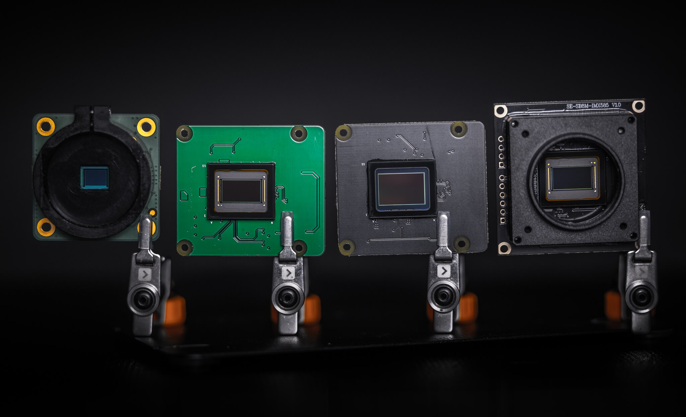
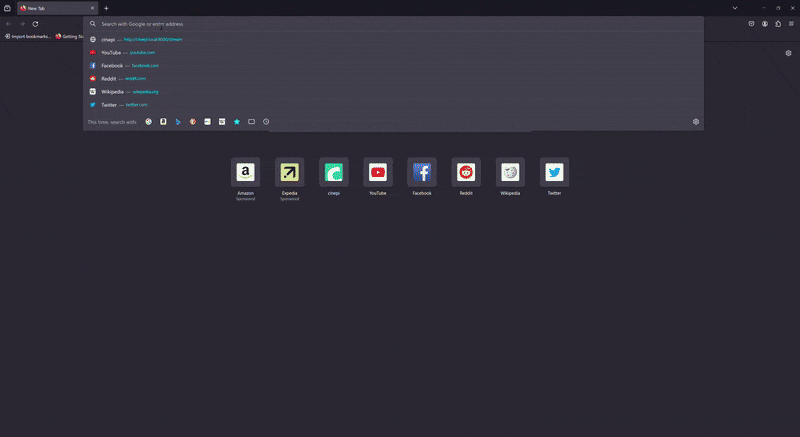
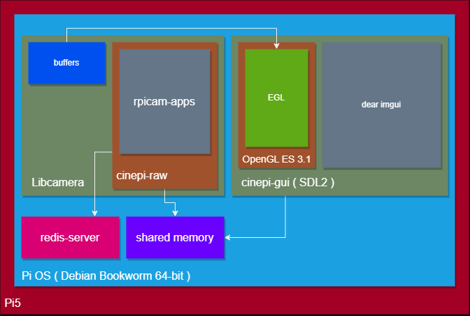

***Collection of software components for development of open source cinema camera using raspberry pi hardware and software.***


# Overview
The purpose of this repository is to host pre-built images that include all necessary software and drivers to facilitate quick-and-easy development of cinepi software components. 

Based on the latest Debian release for Raspberry Pi ( Bookworm ). Head to the [releases](https://github.com/cinepi/cinepi-sdk/releases) page to download the latest pre-zipped `.img` file and flash to your micro-sd card to get started! 


# Supported Hardware

CinePI cameras are based around Raspberry Pi hardware / software.

1st party camera modules from Raspberry Pi are supported out of the box, 3rd party sensor modules designs from [Will Whang](https://github.com/will127534) and [Soho-enterprise](https://soho-enterprise.com/) are also supported.  

## Mainboards
- ~~Raspberry Pi 4B / Compute Module 4~~ (***Unsupported***)
- Raspberry Pi 5 ( 4/8 GB )

## Image Sensor Modules

*HQ Camera Module, StarlightEye, OneInchEye, SE-SB8M-IMX585*
- [Raspberry Pi HQ Camera ( IMX477 )](https://www.raspberrypi.com/products/raspberry-pi-high-quality-camera/)
- [Raspberry Pi Camera Module 3 ( IMX708 )](https://www.raspberrypi.com/products/camera-module-3/)
- [OneInchEye ( IMX283 )](https://github.com/will127534/OneInchEye)
- [StarlightEye ( IMX585 )](https://github.com/will127534/StarlightEye)


# Getting started 

## Setup

1. Install the latest image from [releases](https://github.com/cinepi/cinepi-sdk/releases) , `unzip` or use software like [Belena Etcher](https://etcher.balena.io/) to flash the .zip directly to a micro-sd card.

* <details>
    <summary>
    ⚠️<b>SSH Access</b>⚠️
    </summary> <br />

    hostname: `cinepi.local`
    user: `pi`
    password: `1`

    Example for accessing via a terminal: `ssh pi@cinepi.local`
    </details>

2. Depending on which camera module you have decided to use, you will need to modify the `config.txt` found in the boot partition. Enable the correct sensor overlay by uncommenting the appropriate lines for your given sensor module. *By default the image comes with `camera_auto_detect` enabled, so 1st party camera modules from Raspberry Pi should automatically be detected.* ***Connect camera modules to camera port 1.***

```
# Automatically load overlays for detected cameras
camera_auto_detect=1

# OneInchEye Module ( default camera port 1 )
#camera_auto_detect=0
#dtoverlay=imx283

# StarlightEye Module ( default camera port 1 )
#camera_auto_detect=0
#dtoverlay=imx585
```

3. Insert the micro-sd card into the Raspberry Pi and power on. ***Connect the Pi to a display via HDMI*** *( During first boot you may experience a sudden reboot, this is normal as the Pi expands the filesystem. )*

4. Upon successful installation, you will presented with the familiar desktop environment for Raspberry Pi. 

## Testing

Testing can be done after installation by running ***2*** scripts found within the `home` directory. 

1. `run-raw.sh` : this script is responsible for starting the [`cinepi-raw`](https://github.com/cinepi/cinepi-raw) instance that starts and controls the camera. 

2. `run-gui.sh` : this script is responsible for starting the [`cinepi-gui`](https://github.com/cinepi/cinepi-gui) instance that displays the live camera preview, overlays and controls. 


In addition when running the `run-raw.sh` script, you can also preview a live MJPEG stream via a browser on port `8000` on the route `/stream`. For example on another computer sharing the same network as the pi; go to: `cinepi.local:8000/stream`



## Development

This SDK has been provided as a means to promote development of CinePI software components in a structured and collaborative environment. 

### Architecture / Design

Below is high level overview of the hardware and software components of a CinePI based camera. 



For detailed breakdowns of the individual software components such as [`cinepi-raw`](https://github.com/cinepi/cinepi-raw) or [`cinepi-gui`](https://github.com/cinepi/cinepi-gui), please visit their respective repositories for more details. 

